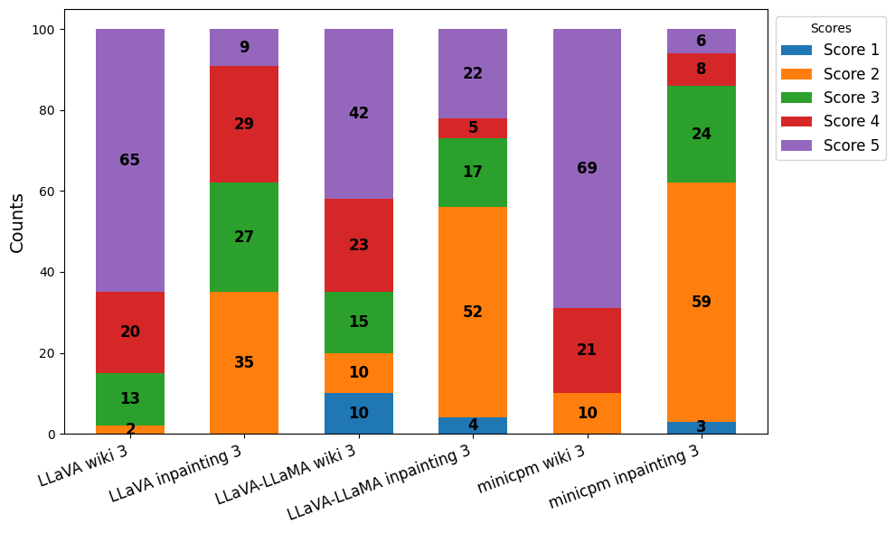
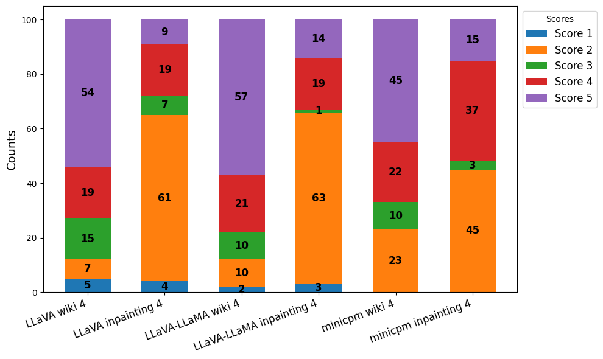

# Assessing Open Source LMMs Capabilities at Detecting Deepfake Images

Using different open source models and prompting techniques

Original dataset can be found here: https://huggingface.co/datasets/OpenRL/DeepFakeFace

## Why it is Important

As the prevalence of deepfake technology increases, the need for readily available, easy to use detection tools is critical. 
Recently the surge of available large multimodal models (LMMs) has fundamentally changed the way users interact with models. 
Since they are small, open source LMMs are able to run locally on a wide variety of hardware while keeping safe and private 
connections in a closed system. This research assesses local LMMs capabilities at detecting real and deepfake images using a 
variety of prompts. The dataset used consists of 20,000 real and deepfake images split equally, with the deepfake images 
generated by Stable Diffusion Inpainting. For prompts that require human evaluation, 200 of the images are used
and scored on a scale of 1-5. Initial results reveal open source LMMs are good at detecting real images but struggle to identify 
deepfake images. However, as prompts became more detailed, many models were able to increase their deepfake detection accuracy.

## Prompts

The prompts range from simple yes/no answers to more complex responses requiring reasoning to achieve higher scores in human evaluation. This range allows for a better analysis of how models respond to different prompt languages.

### Prompt List

- Prompt 1: Is this picture a deepfake? Answer with yes or no.

- Prompt 2: Has the person in the picture been altered or augmented in any way? Answer with yes or no.

- Prompt 3: Analyze this image and determine if it is a deepfake. Provide an answer along with an explanation of your reasoning.

- Prompt 4: Analyze the image of a person for signs of deepfake augmentation or manipulation. Look for specific indicators, including: facial inconsistencies, skin texture anomalies, eye and teeth issues, edge artifacts, lighting mismatches, and background distortions. Based on your analysis, do you find evidence of deepfake manipulation? If so, list the specific indicators you detected and explain why they suggest deepfake manipulation. If no evidence is found, state that there are no clear signs of deepfake augmentation.

### Prompt Design Rationale

- Prompt 1 and 2: Use differing language to assess whether models exhibit bias toward the term deepfake or its alternatives.

- Prompt 3 and 4: Require both a classification (deepfake or not) and an explanation. Prompt 4 is highly specific, providing explicit details on what to look for.

## Evaluation

The evaluation focuses on measuring how models react to different image types.

### Prompts 1 and 2 (Accuracy-Based Evaluation)

- Wiki Accuracy: Measures accuracy when predicting real images.

- Inpainting Accuracy: Measures accuracy when identifying deepfake images.

- Average Accuracy: The average of Wiki Accuracy and Inpainting Accuracy.

### Prompts 3 and 4 (Qualitative Scoring)

Responses are scored using the following scale:

- Score 1: Hallucination or irrelevant answer.

- Score 2: Incorrect answer.

- Score 3: Refused to answer or requested more context.

- Score 4: Correct answer, but not always coherent or relevant; may express uncertainty.

- Score 5: Correct, coherent answer with clear reasoning and no doubt.

This scoring method provides a qualitative way to measure correctness, coherence, and relevance.

## Results

### Prompt 1
The results from Prompt 1 indicate a significant discrepancy in detecting real versus deepfake images. Models generally performed poorly when identifying deepfake images, 
suggesting they struggled to detect anomalies in the Inpainting dataset. This may be due to the simplicity of the yes/no response required by Prompt 1.

- LLaVA: Did not excel in any category, did relatively well against real images.

- LLaVA-Llama: Demonstrated the best overall average accuracy (56.82%) due to better performance on deepfakes (44.68%).

- MiniCPM-V: Exhibited the highest accuracy on real images (99.35%) but the lowest on deepfakes (3.52%), indicating a bias toward real images.

| **Model**         | **Wiki (%)** | **Inpainting (%)** | **AVG (%)** |
|-------------------|--------------|--------------------|-------------|
| **LLaVA**         | 79.32        | 23.63              | 51.18       |
| **LLaVA-Llama**   | 68.95        | **44.68**          | **56.82**   |
| **MiniCPM-V**     | **99.35**    | 3.52               | 51.43       |

These results highlight the difficulty models face when detecting subtle manipulations in deepfake images, particularly when prompts provide limited guidance.

### Prompt 2
From propmt 2 there is an increase across all models at detecting the deepfake images but suffer in their accuracy for real images. This is likely due to how prompt 2 
is more ambiguous causing the models to generalize more and detecting slight photo editing as deepfake anomalies.

- LLaVA: Saw minimal loss in accuracy for real images but an increase deepfake detection.

- LLaVA-Llama: Demonstrated the best overall average accuracy (56.55%) due to better performance on deepfakes (46.22%) but saw a large decress in real image accuracy.

- MiniCPM-V: Exhibited the highest accuracy on real images (97.69%) but the lowest on deepfakes (15.14%), the bias toward real images was reduced but is still significant.

| **Model**         | **Wiki (%)** | **Inpainting (%)** | **AVG (%)** |
|-------------------|--------------|--------------------|-------------|
| **LLaVA**         | 74.30        | 34.87              | 54.59       |
| **LLaVA-Llama**   | 66.87        | **46.22**          | **56.55**   |
| **MiniCPM-V**     | **97.69**    | 15.14              | 52.29       |

### Prompt 3

Human Evaluation scoring for prompt 3. Wiki Scores tend to be confident and correct. Inpainting scores are mostly incoherent or in low confidence. In general, models preform vastly different
on the same prompts. This trend can be seen with high the frequency of purple is for 'Wiki' images but either wrong or doubtful for 'Inpainting' images.

### Prompt 4

Human Evaluation scoring for prompt 4. Since prompt 4 is highly specific and forces the models to look for specific artifacts there is a noticable difference is lower preformance especially in 'Wiki'
images. The only model to get a significant increase in deepfake detection was MiniCPM-V but comparing to the other models there is lower preformance across the board.

With both human evaluation scoring and binary classification prompts, there is a trend of the models being confident in the real image responses, but on deepfake images even if they are right, tend to cast doubt. 
This is most likely a security response because of the sensitivity that occurs when evaluating deepfakes. Additonally, a hyperspecific prompt sees a decrease in preformance compared to a less restrictive prompt. 

## Conclusion and Further Test

Based on the results small open source models tend to struggle at detecting deepfake images. By using different prompts, there is an increase of preformance, but introducing hyperspecific amomalies to look out for does not lead
to better preformance. To continue testing more models can be implemented and in addition different sizes of models. 
