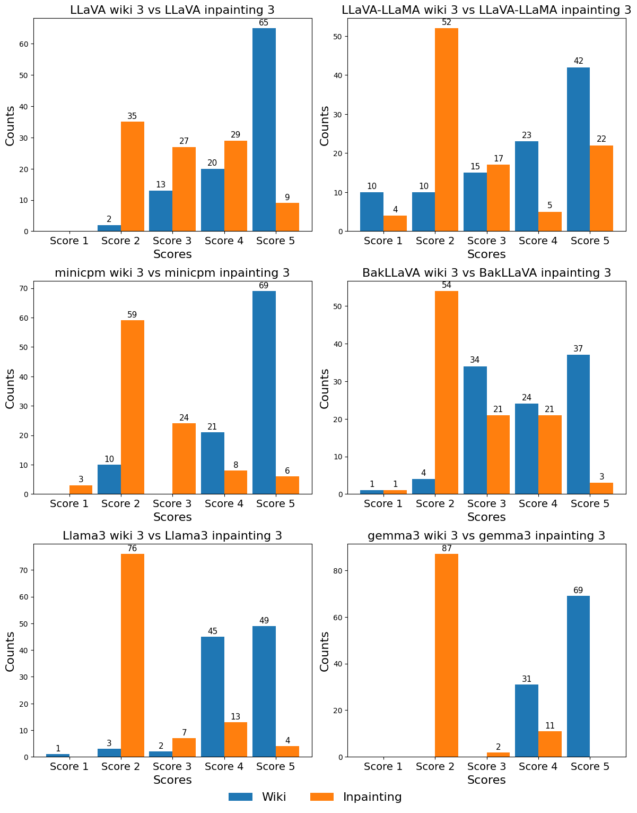
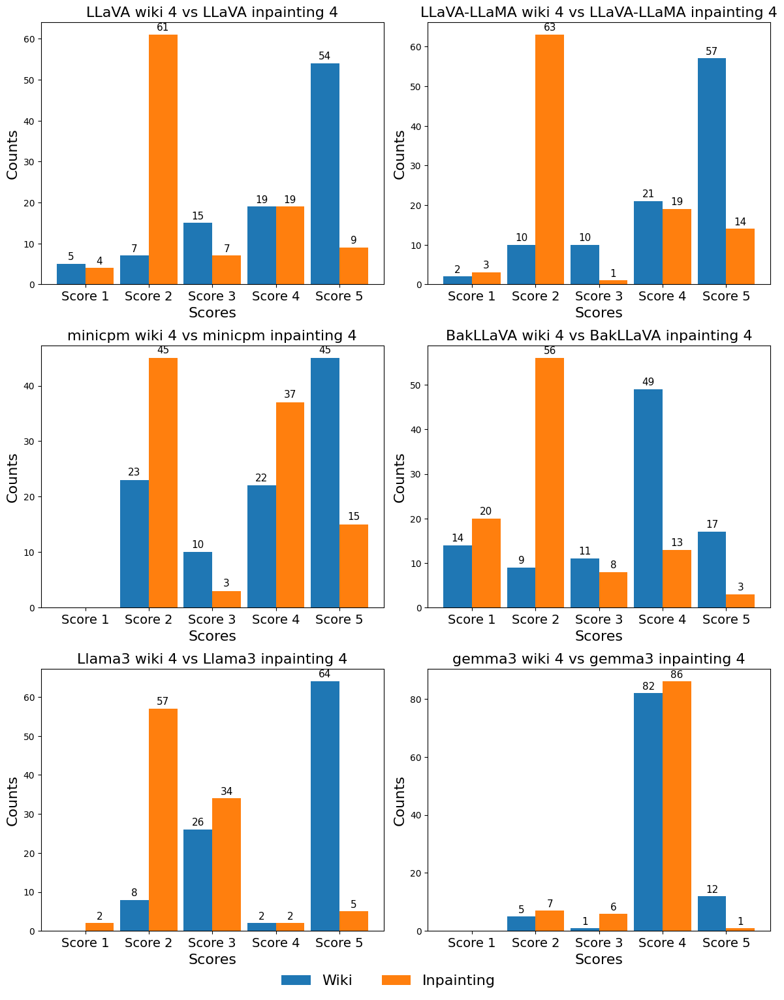

# Assessing Open Source LMMs Capabilities at Detecting Deepfake Images

Using different open source models and prompting techniques

A more indepth analysis can be found in the <a href="./Assessing Open Source LMMs.pdf" target="_blank">Assessing Open Source LMMs.pdf</a> paper.

Original dataset can be found here: https://huggingface.co/datasets/OpenRL/DeepFakeFace

## Installation Setup

- Software
  - Download <a href="https://ollama.com/"> Ollama</a>
    - All models used can be found from the Ollama webiste
    - To install a model run `ollama run "model_name"` in a terminal
    - For further testing or if you want to run other models not available from Ollama `.gguf` files can be imported 
    - For more information please reference the Ollama documentation 
  - Python version 3.12.8
    - Install dependencies from requirements.txt

## Why it is Important

As the prevalence of deepfake technology increases, the need for readily available, easy to use detection tools is critical. 
Recently the surge of available large multimodal models (LMMs) has fundamentally changed the way users interact with models. 
Since they are small, open source LMMs are able to run locally on a wide variety of hardware while keeping safe and private 
connections in a closed system. This research assesses local LMMs capabilities at detecting real and deepfake images using a 
variety of prompts. The dataset used consists of 20,000 real and deepfake images split equally, with the deepfake images 
generated by Stable Diffusion Inpainting. For prompts that require human evaluation, 200 of the images are used
and scored on a scale of 1-5. Initial results reveal open source LMMs are good at detecting real images but struggle to identify 
deepfake images. However, as prompts became more detailed, many models were able to increase their deepfake detection accuracy.

## Prompts

The prompts range from simple yes/no answers to more complex responses requiring reasoning to achieve higher scores in human evaluation. This range allows for a better analysis of how models respond to different prompt languages.

### Prompt List

- Prompt 1: Is this picture a deepfake? Answer with yes or no.

- Prompt 2: Has the person in the picture been altered or augmented in any way? Answer with yes or no.

- Prompt 3: Analyze this image and determine if it is a deepfake. Provide an answer along with an explanation of your reasoning.

- Prompt 4: Analyze the image of a person for signs of deepfake augmentation or manipulation. Look for specific indicators, including: facial inconsistencies, skin texture anomalies, eye and teeth issues, edge artifacts, lighting mismatches, and background distortions. Based on your analysis, do you find evidence of deepfake manipulation? If so, list the specific indicators you detected and explain why they suggest deepfake manipulation. If no evidence is found, state that there are no clear signs of deepfake augmentation.

### Prompt Design Rationale

- Prompt 1 and 2: Use differing language to assess whether models exhibit bias toward the term deepfake or its alternatives.

- Prompt 3 and 4: Require both a classification (deepfake or not) and an explanation. Prompt 4 is highly specific, providing explicit details on what to look for.

## Evaluation

The evaluation focuses on measuring how models react to different image types.

### Prompts 1 and 2 (Accuracy-Based Evaluation)

- Wiki Accuracy: Measures accuracy when predicting real images.

- Inpainting Accuracy: Measures accuracy when identifying deepfake images.

- Average Accuracy across both image sets

- F1 score calculated across both image sets

### Prompts 3 and 4 (Qualitative Scoring)

Responses are scored using the following scale:

- Score 1: Hallucination or irrelevant answer.

- Score 2: Incorrect answer.

- Score 3: Refused to answer or requested more context.

- Score 4: Correct answer, but not always coherent or relevant; may express uncertainty.

- Score 5: Correct, coherent answer with clear reasoning and no doubt.

This scoring method provides a qualitative way to measure correctness, coherence, and relevance.

## Results

### Prompt 1
The results from Prompt 1 indicate a significant discrepancy in detecting real versus deepfake images. Models generally performed poorly when identifying deepfake images, 
suggesting they struggled to detect anomalies in the Inpainting dataset. This may be due to the simplicity of the yes/no response required by Prompt 1.

| **Model**         | **Wiki (%)** | **Inpainting (%)** |**F1 Score** |
|-------------------|--------------|--------------------|-------------|
| **LLaVA**         | 79.32        | 23.63              | 0.329       |
| **LLaVA-Llama**   | 68.95        | **44.68**          | **0.509**   |
| **MiniCPM-V**     | 99.35        | 3.52               | 0.068       |
| **BakLLaVA**      | 91.43        | 23.04              | 0.350       |
| **LLaMA 3**       | 99.90        | 01.43              | 0.028       |
| **Gemma 3**       | **99.92**    | 06.22              | 0.117       |

### Prompt 2
From propmt 2 there is an increase across all models at detecting the deepfake images but suffer in their accuracy for real images. This is likely due to how prompt 2 
is more ambiguous causing the models to generalize more and detecting slight photo editing as deepfake anomalies.

| **Model**         | **Wiki (%)** | **Inpainting (%)** |**F1 Score** |
|-------------------|--------------|--------------------|-------------|
| **LLaVA**         | 74.30        | 34.87              | 0.515       |
| **LLaVA-Llama**   | 66.87        | 46.22              | 0.566       |
| **MiniCPM-V**     | 97.69        | 15.14              | 0.259       |
| **BakLLaVA**      | 61.28        | **56.41**          | **0.578**   |
| **LLaMA 3**       | **98.63**    | 05.72              | 0.107       |
| **Gemma 3**       | 91.11        | 21.74              | 0.333       |

### Prompt 3

Human Evaluation distribution for prompt 3. Wiki Scores tend to be confident and correct. Inpainting scores are mostly incorrect or the model refuses to respond. In general, the distribution 
of responses are inverse from real and deepfake images.

### Prompt 4

Human Evaluation scoring for prompt 4. Similar trends appear like in prompt 3 with some outliers gaining significant improvements. Increasing how specific a particular prompt is written does 
not lead to general improvements.

With both human evaluation scoring and binary classification prompts, there is a trend of the models being confident in the real image responses, but on deepfake images even if they are right, tend to cast doubt. 
This is most likely a security response because of the sensitivity that occurs when evaluating deepfakes. Additonally, a hyperspecific prompt sees a decrease in preformance compared to a less restrictive prompt.

## Conclusion
This work presents a focused evaluation of the capabilities of small open source large multimodal models to detect deepfakes using progressively complex prompts. By leveraging a dataset with subtle facial anomalies and integrating both quantitative and qualitative analyses, it is uncovered that prompt design, model architecture, and task framing can influence model performance. The findings highlight that while small LMMs can detect real images, their deepfake detection capabilities are dependent on prompt structure and types of anomalies present. For future work, there will be a larger focus on reducing bias by expanding the amount of human evaluators. Introduce additional evaluation techniques to test how model architecture can affect performance and detection. Additionally, expanding the diversity of the dataset to account for different techniques of augmentation seen across different generative methods.
